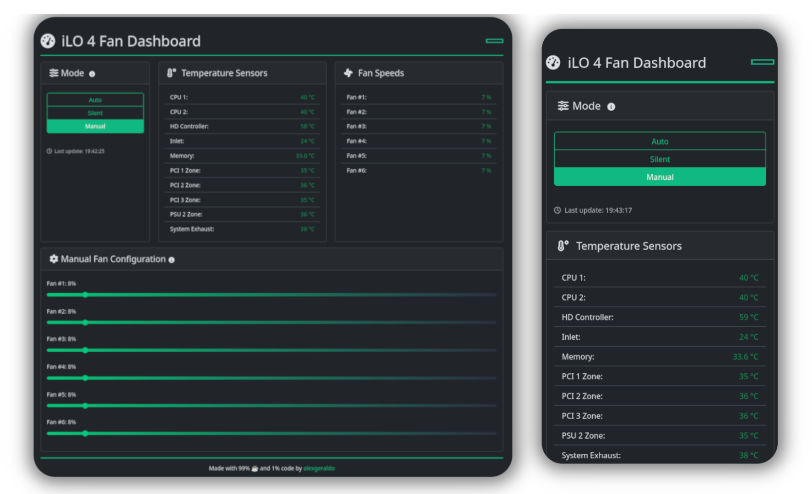

<div align="center">
  <h1 align="center">iLO Fan Control Dashboard</h1>
  

  <p align="center">
    HP iLO Fan Control Dashboard is a responsive web interface for controlling and monitoring fan speeds on HP Gen8 servers with <a href="https://github.com/kendallgoto/ilo4_unlock">unlocked iLO 4 firmware</a>. It combines FastAPI, HTMX and Bootstrap to offer real-time telemetry, manual/auto fan modes, and a seamless experience across devices.
  </p>
  <small><p align="center">Built for homelab users who want silence, efficiency, and control — no full-stack overhead required.</p></small>

</div>

## 📚 Table of Contents

- [🐳 Use with Docker](#-use-with-docker)
- [❓ FAQ](#-faq)
  - [What hardware is supported? 💻](#what-hardware-is-supported-)
  - [Is it safe to expose this dashboard publicly? 🌍](#is-it-safe-to-expose-this-dashboard-publicly-)
  - [Why build this when other dashboards already exist? 🧐](#why-build-this-when-other-dashboards-already-exist-)
  - [Does the interface work on mobile devices? 📱](#does-the-interface-work-on-mobile-devices-)
  - [What control modes are available? ⚙️](#what-control-modes-are-available-)
  - [What features are lacking? 🧩](#what-features-are-lacking-)
- [🧰 Manual Setup](#-manual-setup)
- [🛠️ Contributing](#-contributing)
- [🙏 Acknowledgments](#-acknowledgments)
- [📄 License](#-license)

<br/>


## 🐳 Use with Docker

If you already have a Docker environment deployed, its best to get the app running in seconds:

```bash
docker run -d --rm \
  -p 8000:8000 \
  -e ILO_HOST="ilo-ip-address" \
  -e ILO_USER="ilo-user" \
  -e ILO_PASS="ilo-password" \
  alexgeraldo/ilo-fan-control:latest
```

Then open [http://localhost:8000](http://localhost:8000) in your browser.

> **ℹ Tip:** You can use `--restart unless-stopped` if you want the container to persist across reboots.

The Dockerfile is also included in the repository, so you can clone the project and easily build a customized version with different configurations or extended functionality that suits your needs.


## ❓ FAQ

### What hardware is supported? 💻

This dashboard was tested with the **HP ProLiant DL380p Gen8** server running [unlocked iLO 4 firmware](https://github.com/kendallgoto/ilo4_unlock) version 2.73.

Other HP servers using the same iLO 4 firmware may also be compatible. If you're using a different model and encounter issues, feel free to open an issue — support for additional models can be added based on user feedback and availability.

> ⚠️ Gen10 servers with iLO 5 are not supported, as they do not allow low-level SSH access to fan PID parameters.

### Is it safe to expose this dashboard publicly? 🌍

⚠️ **No!** The app has no built-in authentication, so exposing it directly to the internet is not recommended.

If you need remote access, I recommend:

- A reverse proxy (e.g. NGINX) with HTTP Basic Auth
- VPN access (e.g. Tailscale or OpenVPN)

### Why build this when other dashboards already exist? 🧐

There are some great projects out there, like [iLO Fans Controller by alex3025](https://github.com/alex3025/ilo-fans-controller/), which I used and appreciated. But for my use case, I needed something a bit more flexible and hands-off for long-term operation:

- **Real-time temperature monitoring**, not just manual presets  
- **A watchdog mechanism** that can detect overheating and automatically switch back to auto mode  
- A **clean, Python-based backend** that I could easily understand and modify  
  > (I'll admit — I'm not great with anything else 😜)

This project came out of the need to automate fan management on my Gen8 server: keeping it quiet most of the time, but safe when things heat up — without having to SSH into iLO every time the weather changes.

### Does the interface work on mobile devices? 📱

Yes! The dashboard uses Bootstrap for responsive design and was tested on all screens.

### What control modes are available? ⚙️

- **Auto mode**: Fan speeds are fully managed by iLO's internal PID controller.  
- **Silent mode**: Sets the fans to the lowest possible speed to reduce noise — perfect for quiet environments.  
  > (Personally, I use it at night since I sleep next to this bad boy 😜 — hence the watchdog requirement.)   
- **Manual mode**: Allows you to set fixed fan speeds manually, giving full control over cooling behavior.

### What features are lacking? 🧩

Right now, the dashboard is quite minimal and intentionally simple — it doesn't support saving presets, nor does it persist fan settings between restarts or sessions. Every time you reload or reboot, the fans will be reseted and put into Auto mode.

This project was built by me, a msc computer science student, during my free time as a practical and lightweight tool to manage my own server. I focused on getting a functional prototype up and running quickly, using technologies I’m comfortable with.

I do plan to improve the app — adding persistent configurations, profile presets, better API specification, and perhaps even better iLO integration. But future development depends entirely on my time and availability. Contributions and ideas are always welcome!


## 🧰 Manual Setup

For development or running the app without Docker:

1. **Clone the repository:**

```bash
git clone https://github.com/alexgeraldo/ilo-fan-control.git
cd ilo-fan-control
```

2. **Create a virtual environment (recommended):**

```bash
python3 -m venv .venv
source .venv/bin/activate
```

3. **Install dependencies:**

```bash
pip install -r requirements.txt
```

4. **Run the application:**

```bash
uvicorn main:app --host 0.0.0.0 --port 8000
```

By default, the app reads the environment variables `ILO_HOST`, `ILO_USER` and `ILO_PASS` from your shell session. If you prefer not to define system-wide or user-wide environment variables, you can also run it like this:

```bash
ILO_HOST="ilo-ip-address" ILO_USER="ilo-user" ILO_PASS="ilo-password" uvicorn main:app --host 0.0.0.0 --port 8000
```


## 🛠️ Contributing
Contributions, issues, and feature requests are welcome!  
Feel free to submit a PR or open an issue on GitHub.


## 🙏 Acknowledgments

- [kendallgoto/ilo4_unlock](https://github.com/kendallgoto/ilo4_unlock) – for the unlocked iLO 4 firmware that makes all of this possible  
- [alex3025/ilo-fans-controller](https://github.com/alex3025/ilo-fans-controller) – inspiration from the original PHP fan controller project  
- [FastAPI](https://fastapi.tiangolo.com/) – for the web framework powering the backend  
- [HTMX](https://htmx.org/) – for enabling dynamic frontend interactivity without needing a JS framework  
- [Bootstrap](https://getbootstrap.com/) – for the responsive UI  
- [Font Awesome](https://fontawesome.com/) – for icons used in the dashboard UI  
- [Python](https://www.python.org/) – because, well... everything  
- The **homelab community** – for sharing tools, ideas, and firmware patches 😄


## 📄 License

This project is licensed under the MIT License – see the [LICENSE](LICENSE) file for details.

---

**📬 Stay Updated**  
Follow **[@alexgeraldo](https://github.com/alexgeraldo)** on GitHub.

---
